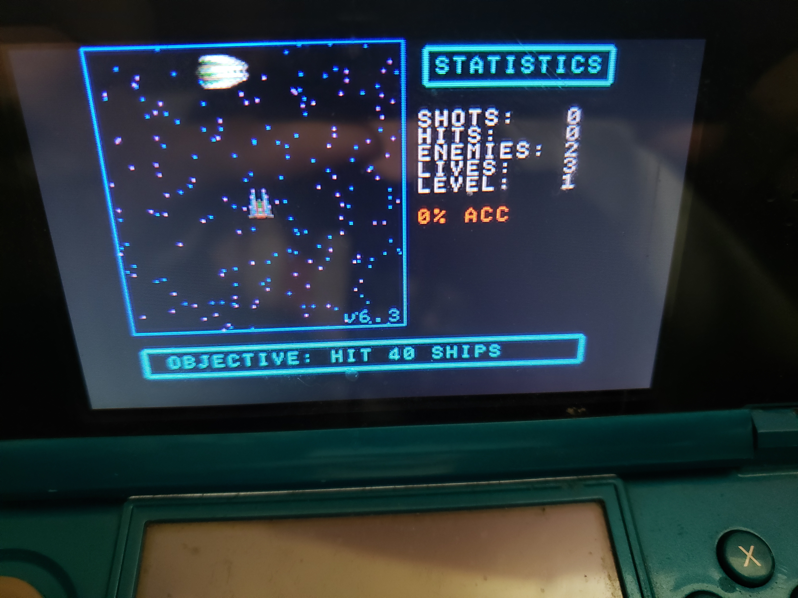
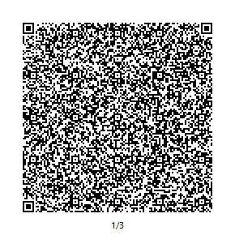
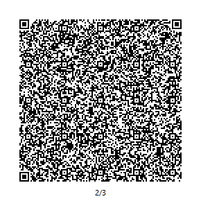
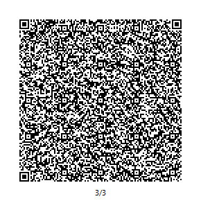
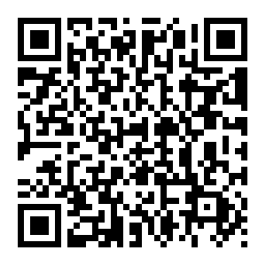

# Space Shooter
This is a retro style space shooter I made using [Petit Computer](https://en.wikipedia.org/wiki/Petit_Computer) on my DS when I was 14.

 

# How to Play
Open up Petit Computer on your DSi, tap `File Management`, then tap `Read QR Codes`. Scan the 3 QR codes below in order, and it'll add `PRG:SHOOTER` to your gallery.

### Sad News
If you do not already have a copy of Petit Computer then you will not be able to play this game. The Nintendo DSi Shop has been closed since March 31, 2017, so Petit Computer is no longer available for purchase or download.
#### Edit:
After some messing around, I've figured out how to extract the `.nds` file for installation on a DSi. I can't test if it works, or if there's even a way to install it, since I don't own a DSi. I've tested it on emulators, and it doesn't work.

I've also packaged the `.nds` file into a `.cia` file for installation on a 3DS. This file will also not work on an emulator, but if loaded onto a 3DS, it works properly. 

To install the `.cia` file, you'll need an app called **FBI**. My recommendation is to follow [this guide](https://3ds.hacks.guide/get-started), which will grant you root access on your 3DS and install **FBI** along with a few other useful apps. Another option is to use the [Homebrew Launcher](https://smealum.github.io/3ds/) to launch the `FBI.3dsx` file available [here](https://github.com/Steveice10/FBI/releases). Homebrew's benefit is that its much easier to install than the other method, but the drawback is that it only works with certain models and firmware versions, so you might not be able to use it.

From the main menu of the `FBI` app, go to `Remote Install`, then `Scan QR Code` and scan the code below to download and install Petit Computer. After the installation is complete, exit the app, then restart your system. You should now see the new app on your home menu.

 

### Possible Future
The creators of Petit Computer have made a new version of it for the 3DS called [SmileBASIC](https://www.nintendo.com/games/detail/smilebasic-3ds/#game-info). The manual says the following:
>The BASIC language used in this product is not compatible with pre-existing versions of BASIC. Please also note that this product is not compatible with our Petit Computer and Petit Computer mkII products. Please make sure to pay attention to the differences in syntax when attempting to port programs from these products.

So what I gather from this is that copying the old script directly over to the new version probably won't work out-of-the-box, but with a bit of touching up, it shouldn't be too difficult.